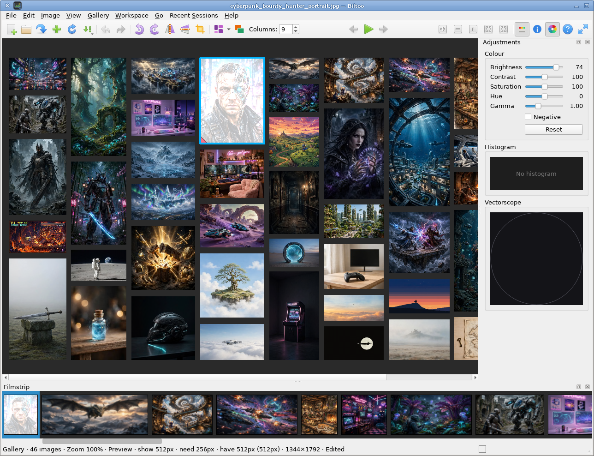
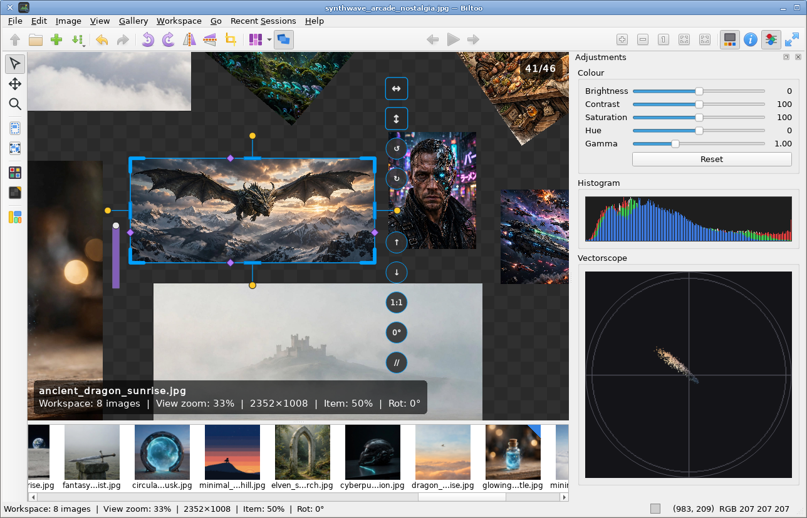

<!--
SPDX-FileCopyrightText: 2026 Ingo Ruhnke <grumbel@gmail.com>
SPDX-License-Identifier: GPL-3.0-or-later
-->

# Biltoo

**Biltoo** is a Qt 6 desktop image viewer with three modes on one canvas:

| Mode | Purpose |
|------|---------|
| **Image** | One file at a time — zoom, pan, rotate, flip, crop, slideshow |
| **Gallery** | Overview of the whole session in packed layouts |
| **Workspace** | Arrange several images freely for comparison and export |

**Gallery**



**Workspace**



Requires **Qt 6.9** or newer.

## Features

### Session and files

- Open files, directories, or **archives** (zip, tar, 7z, rar, …) from the file
  dialog, drag-and-drop, or the command line
- **Open** replaces the session; **Add** and drops append
- Recent sessions and recent projects
- Sort by name, path, date, size, dimensions, aspect ratio, shuffle, and more
- Thumbnail bar with flexible placement and labels

### Image mode

- Zoom in/out, 1:1, fit, fill, and rubber-band zoom
- Optional sticky fit / fill / 1:1 when stepping through a session
- Rotate, flip, and non-destructive crop (session only until you export)
- Slideshow with adjustable dwell, transitions, and optional pan-and-scan
- Fullscreen and a simple HUD

### Gallery and Workspace

- Gallery layouts: strip, grid, masonry, and related packings
- Workspace: free placement, multi-select, framing for comparison
- New window for a second view of the selection

### Export and projects

- Print and print preview; export PDF or PNG
- **Projects** (`.biltoo`): session layout and appearance with content-hash
  addressing for external files
- Source files are never overwritten by export

### Keyboard shortcuts

Press **F1** in the app for the full list. Common bindings:

| Keys | Action |
|------|--------|
| ← / → | Previous / next |
| Space | Slideshow start/stop |
| `[` / `]` | Slideshow slower / faster |
| F / F11 | Fullscreen |
| Ctrl+0 / + / − | 1:1 / zoom in / out |
| Z | Zoom to region |
| C | Crop |
| R | Rotate right |
| Ctrl+O / Ctrl+S | Open / save project |

## Command line

```bash
biltoo [options] [files-or-dirs…]
```

| Option | Meaning |
|--------|---------|
| `--fullscreen` | Start fullscreen |
| `--slideshow` | Start slideshow |
| `--debug` | Extra diagnostics |

Drag-and-drop onto the window appends to the session. Shortcuts apply per
window when several windows are open.

## Image formats

Common formats use Qt. Extra types (for example GIMP `.xcf`) work when
**KImageFormats** plugins are available — the Nix package includes them.
Opening images inside archives needs **libarchive** at build time.

## Settings

Preferences use the normal Qt config location (for example
`~/.config/biltoo/biltoo.conf` on Linux). Window geometry is restored across
runs. Sticky fit/fill/1:1 is remembered when you set it.

## Build and install

Version is read from the top-level `VERSION` file (currently `0.1.0-dev`).

### Nix

```bash
nix run github:Grumbel/biltoo
# from a checkout:
nix develop
nix build
nix run
```

### CMake

Needs Qt 6.9+ (Widgets and related modules).

```bash
cmake -B build -S .
cmake --build build
./build/biltoo
```

Optional libraries are detected with pkg-config; the configure summary lists
what was found:

| Library | Enables |
|---------|---------|
| **libvips** | Extra codecs, EXIF orientation helpers, attention-based pan-and-zoom |
| **libexiv2** | Richer metadata panel |
| **libarchive** | Images inside archives |
| **gio-unix-2.0** | “Default application” preference on Linux |
| **[thumtoo](https://github.com/Grumbel/thumtoo)** | Durable size index and preview tiles (faster reopen) |

**thumtoo** (recommended): build against a thumtoo source tree:

```bash
cmake -B build -S . -DTHUMTOO_SOURCE_DIR=/path/to/thumtoo
```

With Nix flakes, thumtoo is pulled in automatically. Sibling checkouts named
`../thumtoo` are also picked up by the development helpers when configured.

### Desktop files

Install (CMake or Nix) can place a `.desktop` entry, AppStream metainfo, icon,
and man page under the usual `$prefix/share/…` paths so file managers can open
images with Biltoo.

## License

GPL-3.0-or-later.
