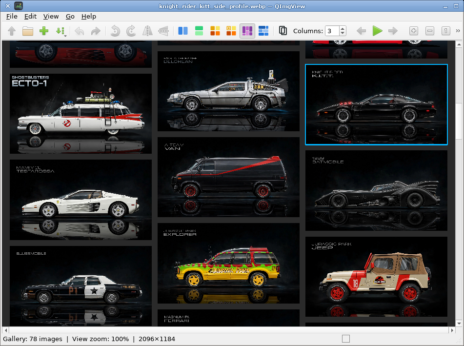

# QImgView

A classic Qt image viewer with three presentation modes on one canvas:

- **Image** — single-image browsing (zoom, pan, rotate, slideshow)
- **Gallery** — session overview with packaged layouts
- **Workspace** — free-form multi-image comparison

Behavioural model (modes, operations, invariants): [DOMAIN.md](DOMAIN.md).
Agent / contributor notes: [AGENTS.md](AGENTS.md).



## Project home

- GitHub: <https://github.com/Grumbel/qimgview>
- Radicle: [`rad:z3BEnqZd8JN1DNMPEuLPv5ACgzq3a`](https://radicle.network/nodes/rosa.radicle.network/rad:z3BEnqZd8JN1DNMPEuLPv5ACgzq3a)

## Features

- Fast single-image browsing with zoom, pan, rotate, and flip
- Thumbnail bar for the current session; open files or directories from the UI or the command line
- **Gallery**: packaged layouts (horizontal/vertical strip, grid, grid-crop, masonry); multi-select; double-click opens Image mode; **Up** returns with scroll restore
- **Workspace mode**: free-form canvas — move, scale, rotate, opacity, stacking; rubber-band select; view-space transform handles ([HANDLES.md](HANDLES.md))
- Session sort by name, date, file size, width, height, or pixel count (menu + toolbar)
- Slideshow with optional fullscreen; `[` / `]` adjust interval while running
- Drag and drop **appends** to the session in Image mode (File → Open still replaces); File → New clears the session
- Metadata panel (file info; optional Exif/IPTC/XMP when built with libexiv2)
- Configurable canvas background (solid or checkerboard)
- Theme icons, fullscreen, and preferences for sort order, slideshow, and default applications

## Usage

```bash
qimgview [options] [files-or-directories…]
```

Useful options:

| Option | Description |
|--------|-------------|
| `-r`, `--recursive` | Expand directories recursively |
| `--sort=name\|mtime` | Sort order for loaded files (UI also offers size / dimensions) |
| `--slideshow` | Start the slideshow |
| `--interval=ms` | Slideshow interval in milliseconds |
| `--thumbnails` / `--no-thumbnails` | Force thumbnail bar on or off |

Drag and drop image files onto the window. Drops **append** to the current session (Image, Gallery, and Workspace). Use **File → Open** to replace the session, or **File → New** for an empty session.

## Image formats

Decoding uses Qt’s `QImageReader`, then optional **libvips**. For **GIMP `.xcf`**
(and Krita `.kra`, OpenRaster `.ora`, and related types), install **KImageFormats**
so the Qt imageformat plugins are on the plugin path. The Nix package pulls this
in automatically. XCF coverage matches KImageFormats (roughly up to XCF v12;
zlib-compressed and newest GIMP 3 files may not load).

## Building

**Nix** (recommended):

```bash
nix develop    # development shell
nix build      # package
nix run        # build and run
```

**Manual** (Qt6 Widgets, CMake; optional libvips, libexiv2, GLib GIO):

```bash
mkdir build && cd build
cmake ..
cmake --build .
./qimgview
```

## Desktop integration

The package installs:

- `share/applications/qimgview.desktop`
- `share/icons/hicolor/scalable/apps/qimgview.svg`

## License

GPL-3.0-or-later. See [LICENSE](LICENSE) and [REUSE.md](REUSE.md).
