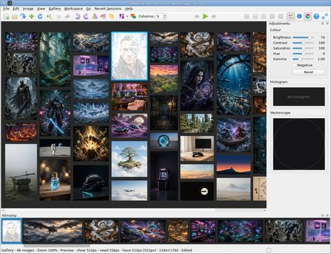
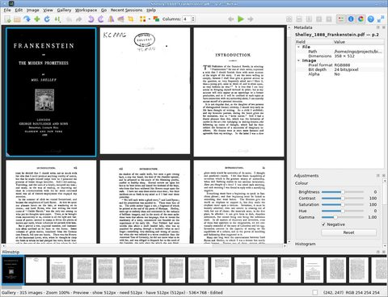
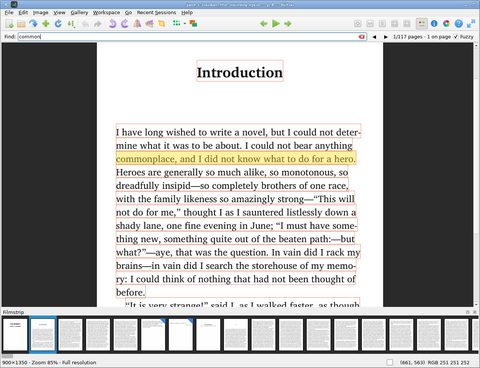
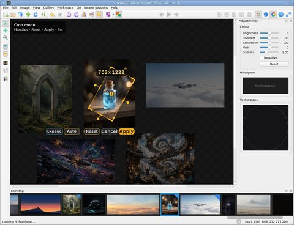

<!--
SPDX-FileCopyrightText: 2026 Ingo Ruhnke <grumbel@gmail.com>
SPDX-License-Identifier: GPL-3.0-or-later
-->

# Biltoo

Biltoo is a desktop image and document viewer for Linux, loosely inspired by
Ristretto but expanded beyond it. It caches image sizes and previews, keeping
large folders and archives responsive instead of repeatedly decoding the same
files.

It supports common image formats including JPEG, PNG, WebP, TIFF, GIF, BMP, and
XCF, as well as multi-page PDF, EPUB, and DjVu documents. Images can also be
viewed directly from ZIP, tar, 7z, RAR, and similar archives without unpacking
them first.

Documents use the same navigation as images: step through pages, zoom and pan,
view a gallery overview, or arrange pages on the workspace.

## Features

* Open individual files, directories, or archives
* Navigate files and pages with the keyboard
* Zoom and pan
* Slideshow and fullscreen modes (tile climb refreshes during the dwell)
* Gallery view for browsing an open set of files
* Workspace for arranging multiple images or pages on a single canvas
* **Double view** (facing pages / fixed-N spread): View → Double view submenu
  for binding, reading direction, and page count; optional dual compare
* Filmstrip with distinct **cursor** (amber) and **selection** (cyan/blue)
  chrome, camera viewport on the current thumb, and spread-member marks
* Configurable chrome colours (Preferences → Interface → Chrome)
* Compare images or pages side by side
* Prepare sheets for print or export
* Export the workspace to PDF or PNG
* Rotate, flip, crop, and adjust colour or contrast
* Session-only editing: the original files are never modified
* Cached image sizes and previews for fast browsing of large collections
* View images directly inside archives without extracting them
* Panels menu for filmstrip, metadata, tools, and optional Messages log
  (hidden by default; preference is remembered)
* Dockable panels via **KDDockWidgets** (nested splits/tabs, saved layout)

## Screenshots

[](screenshots/gallery.png)

[](screenshots/pdf-gallery.png)

[](screenshots/epub-find.png)

[](screenshots/workspace-crop.png)

## Command line

```bash
biltoo [options] [files-or-dirs…]
```

With no files or directories, biltoo opens the **last session** from
File → History (if any). Pass paths or a `.biltoo` project to start with that
content instead.

| Option | Meaning |
|--------|---------|
| `--fullscreen` | Start fullscreen |
| `--slideshow` | Start slideshow |
| `--debug` | Extra diagnostics |

## Build and install

Version is read from the top-level `VERSION` file.

### Nix

```bash
nix run github:Grumbel/biltoo
# from a checkout:
nix develop
nix build
nix run
```

### CMake

Needs Qt 6.9 or newer.

```bash
cmake -B build -S .
cmake --build build
./build/biltoo
```

Optional libraries (pkg-config) enable extra codecs, metadata, archives, and
durable caching via [thumtoo](https://github.com/Grumbel/thumtoo):

```bash
cmake -B build -S . -DTHUMTOO_SOURCE_DIR=/path/to/thumtoo
```

With Nix flakes, thumtoo is included automatically.

## License

GPL-3.0-or-later.
